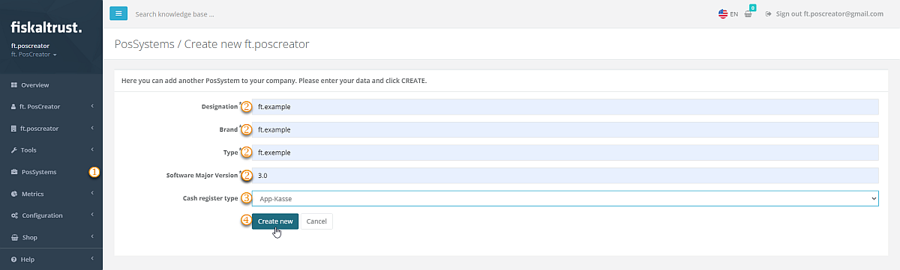
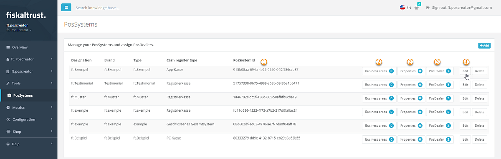
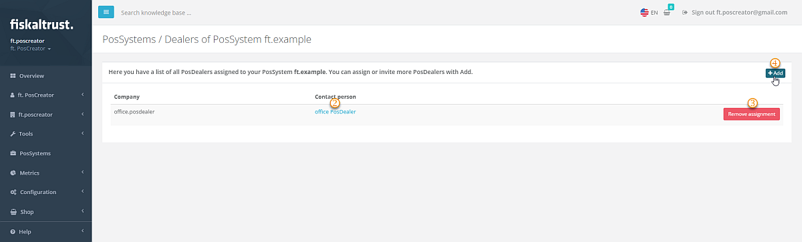
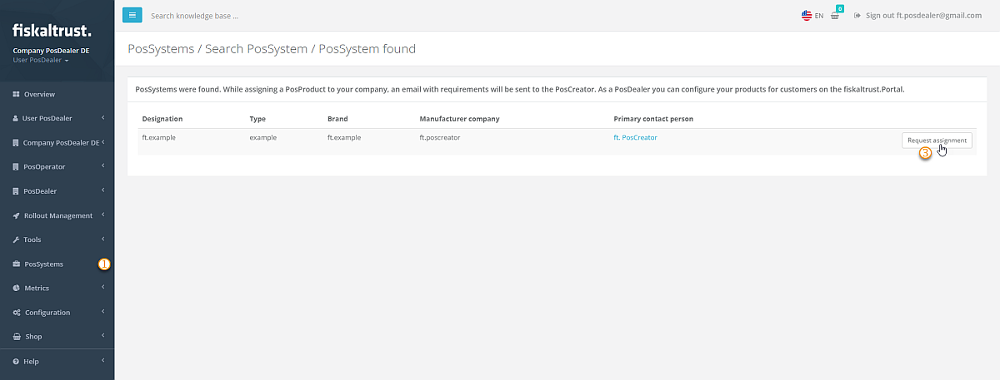

# Getting Started Guide for PosCreators

## Overview

This guide describes on a high level the stages, which a PosCreator should achieve, to ensure a successful completion of the journey, from the integration of the fiskaltrust.Middleware into the POS-System, to a phase of pilot installations.

The success of this journey can be achieved through the completion of the following stages:

## Useful resources

Before proceeding with this guide, you may consider getting familiar with the content of the following useful resources:

- [PosCreator technical onboarding video](onboarding-presentation.md)

**Note:** you can find more useful resources in the [Further sources of information](#further-sources-of-information) section at the end of this document.

## 1. fiskaltrust.Portal Registration

### 1.1 Overview

The fiskaltrust.Portal is a web application which offers features required to easily manage the functions necessary for the configuration and operation of your POS-Systems. The fiskaltrust.Portal is accessible via common Internet browsers, however, if your browser does not display some content correctly, or features are not available or not behaving as expected, try using the current version of Google Chrome.

There are 2 instances of fiskaltrust.Portal:

- Live - [https://portal.fiskaltrust.de](https://portal.fiskaltrust.de/)
- Sandbox - [https://portal-sandbox.fiskaltrust.de](https://portal-sandbox.fiskaltrust.de/)

**Important Notes:**

- In order to receive the free support from fiskaltrust you must register in our live portal.
- No tests should be performed on the Live portal!
- The sandbox registration is needed for conducting all test activities and does not qualify for support!

### 1.2 Registration steps

The registration steps on both, the sandbox and the live portal, are identical. Simply complete the registration form, confirm your email, and sign the cooperation agreement.

### 1.3 Company data and cooperation agreement

As soon as you have registered in the portal, a form for selecting your role will be displayed. Select the option " PosCreator " and sign our cooperation agreement by entering your name in the input field. If you are also a PosDealer, please select that role as well.

By registering in the live fiskaltrust.Portal and digitally signing our cooperation agreement, you are now entitled to access our free support for setup questions and onboarding. You can reach our Support Team at <a href="mailto:support@fiskaltrust.de">support@fiskaltrust.de</a>.

## 2. Middleware Integration

There are several steps which must be followed to successfully integrate your solution with fiskaltrust.Middleware. Those steps include the CashBox Configuration, using the Middleware Launcher, and testing of the communication. Please check our [fiskaltrust.Middleware document](middleware-integration.md) for detailed information about this process.

## 3. PosDealer Onboarding

Once you were able to test the integration and successfully establish a communication with the fiskaltrust.Middleware by sending simple requests and receiving correct expected responses, you are now ready to start engaging your PosDealers into discussion about the details of the specific implementation of your POS-System, and agree on the suitable rollout scenarios.

It is important to involve your PosDealers as early as possible, because they have to perform the following steps, among others, before they can roullout the fiskaltrust.Middleware to the PosOperators:
1. Register in the fiskalttrust.Portal and there digitally sign a cooperation agreement with fiskaltrust.
2. Depending on the circumstances, request and sign framework agreements for the purchase of products with fiskaltrust.
3. Invite the PosOperators to the fiskaltrust.Portal so that they can sign the usage agreement for the fiskaltrust.Middleware.
4. Request access rights to the PosOperator`s fiskaltrust.Account so that the PosDealer can redeem and activate the product entitlements purchased from fiskaltrust
5. Request access rights to the PosOperator`s fiskaltrust.Account so that the PosDealer can configure the fiskaltrust.Middleware instance to be installed on behalf of the operator.
6. For the correct DSFInV-K export the information of the POS-System needs to be connected by the PosDealer with the master data of the PosOperator.
7. Technical planning and preparation for rollout together with the PosCreator.

These steps can be very time consuming. Therefore, we strongly recommend that you **inform your PosDealers as early as possible and especially invite them to register in the fiskaltrust.Portal**.

### 3.1 Invite PosDealer in fiskaltrust.Portal 

:::important

The following steps explain how you, as PosCreator, register a PosSystem in the fiskaltrust.Portal. This registration includes a PossystemID, which ensures that all country-specific requirements are met, regardless of whether they are currently mandatory in your country or will become if you want to expand your offering to other markets. In addition, the fiskaltrust.Portal supports you with a simplified invitation process for your PosDealers.

:::

Log in to the fiskaltrust.Portal and select `PosSystems`, then `Add`. 
Enter the properties of your PosSystem and select `Create new`. 
Once the PosSystem is created, you will find it in the list of your available systems. You can add `Business areas` and `Properties` to each PosSystem. With `PosDealer`, you open the list of assigned PosDealers. To invite more, click on `Add`.  

For more detailed instructions, please open the drop-down window below.

  
Management of PosSystems in Details
  

:::caution

    Depending on the chosen role, the fiskaltrust.Portal offers different items
    on the menu. Suppose the items described here are unavailable;
    check `Company` / `Overview` for the active roles.
    We recommend handling an account as PosCreator and as PosDealer separated. 
:::

#### Creation of a PosSystem

| steps | description                                                                                                                |
|:----------------------:|-------------------------------------------------------------------------------------------------------------------------------------|
| |Log in to the fiskaltrust.Portal as a PosCreator, select `PosSystems` and `Add` to create new ones.   |
| |Enter data like `Name`, `Brand`, `Type` and `Software Major Version` of your new PosSystem.   |
| |Make your selection at `Cash type`.  |
| |With `Create new`, you will find the new PosSystem in the list of your available systems.  |

#### Editing of a PosSystem

| steps | description                                                                                                                |
|:----------------------:|-------------------------------------------------------------------------------------------------------------------------------------|
| |You can find the `PosSystemId` in the list but not change this value.  |
| |You can add `Business areas` (like trade or services) and `Properties` (like technical base or equipment) to each PosSystem.  |
| |With `PosDealer`, you open the list of assigned PosDealers; read below for further details. |
| |You can change the data of the PosSystem with `Edit`.  |

#### Assignment of a PosSystem

| steps | description                                                                                                                |
|:----------------------:|-------------------------------------------------------------------------------------------------------------------------------------|
| |To check assigned PosSystem distributors, select `PosDealer`.  |
| |You find a list of all PosDealers assigned to your chosen PosSystem. Use the link of the `contact person` to send an E-Mail.  |
| |With `Remove assignment`, you cut the connection between the selected PosDealer and the actual PosSystem.  |
| |To assign or invite more PosDealers, select `Add`. |

    To add a PosDealer to a selected PosSystem, enter his E-Mail address and select `Search`. If the desired PosDealer is already registered in the fiskaltrust.Portal, you finalize the assignment of the selected PosSystem. Suppose no company with that E-Mail address is registered in the fiskaltrust.Portal, you must complete the business data and choose `Add / Invite`.This invitation will send an E-Mail and assign the company to your selected PosSystem. The invitation E-Mail contains a link the recipient can use to complete the registration process. 

#### Request of a PosSystem as PosDealer

:::caution

    Depending on the chosen role, the fiskaltrust.Portal offers different items on the menu. Suppose the items described here are unavailable; check `Company` / `Overview` for the active roles. We recommend handling an account as PosCreator and as PosDealer separated.
:::

As a PosDealer, you get either the invitation by a PosCreator to receive the assignment of a PosSystem. Or you reach out to a PosCreator to request the assignment of your desired PosSystem. Please note that this requires that you, as a PosDealer, are registered in the fiskaltrust.Portal.

| steps | description                                                                                                                |
|:----------------------:|-------------------------------------------------------------------------------------------------------------------------------------|
| |Log in to the fiskaltrust.Portal as a PosDealer, select `PosSystems` and `Add` to start your request for new ones.   |
| |Enter data like `Name`, `Brand`, `Type` or `Manufacturer` of your desired PosSystem and press `Search`.   |
| |Make your selection with `Request Assignment`.  |
| |With `ABCXYZ`, your request is sent to the PosCreator.  |

If the PosCreator accepts the assignment, the connection between the PosDealer and the manufacturer's POS-System is established.

### 3.2 Rollout Scenarios

As the approach to the rollout highly depends on the implementation, the components, and the capabilities of your POS-System, you should select the appropriate rollout scenario and discuss it with your POS Dealers, to ensure their sufficient levels of knowledge and understanding required for the successful execution of the rollout process.

The rollout has 2 separate areas, the [buy- and resell part](https://docs.fiskaltrust.cloud/docs/posdealers/buy-resell/overview), and [the technical rollout](https://docs.fiskaltrust.cloud/docs/posdealers/buy-resell/rollout-plans), which are both covered in the the PosDealer area of this documentation.

The technical stage requires a close collaboration of the technical experts from both sides: yours and the POS Dealer`s. You will discuss the details of the implementation, agree on the approach for rollout automation and templating, and select the best strategy for the rollout based on the appropriate rollout scenario. We have documented examples of different [rollout scenarios](https://docs.fiskaltrust.cloud/docs/posdealers/technical-operations/rollout-scenarios) in our documentation portal.

### 3.3 Rollout Automation

You should help the POS Dealer to automate the rollout process as much as possible for example by preparing a configuration `Template` and discussing its details with the POS Dealer. A `Template`, which can be added in the fiskaltrust.Portal or executed via API, contains the details of a pre-configured CashBox with all its components. It is used to automatically create similar CashBoxes for the PosOperators. Such templates can be used among other fiskaltrust tools and features to automate, and therefore to significantly speed-up the rollout process. You can find the [details of the automation options and templating](https://docs.fiskaltrust.cloud/docs/posdealers/technical-operations/rollout-automation/templates) in our documentation portal.

## 4. Complex Business Case Analysis

Each industry may have several specific and complex business cases which require a special handling in terms of requests sent to the fiskaltrust.Middleware. If you require assistance establishing the proper handling of such complex business cases in the implementation of your POS-System, please write us an email to our PosCreator support mailbox at <a href="mailto:support@fiskaltrust.de">support@fiskaltrust.de</a>, and one of our experts will be happy to assist you.

## 5. Pilot Installation

Once the rollout strategy has been selected and the approach to automation of the rollout (e.g. templating) has been agreed, it`s time for you and the PosDealer to test it with selected PosOperator(s). Such pilot installation(s) should provide you with sufficient feedback, to allow early identification of problems and their possible resolutions, before handing over to the PosDealer for mass rollout to multiple PosOperators.

## 6. Handover for Rollout

Once all previous stages have been completed, all preparations are done, the communication with fiskaltrust.Middleware works, the rollout strategy has been agreed, and the pilot installation(s) have been successfully executed, you are now ready to handover for rollout to your PosDealers.
The goal of this stage is about reaching an agreement with the PosDealers that they are ready to start the rollout to the PosOperators.

## Further sources of information

- German fiskaltrust website: [https://fiskaltrust.de](https://fiskaltrust.de/)
- fiskaltrust.Docs: [https://docs.fiskaltrust.cloud](https://docs.fiskaltrust.cloud/)
- Knowledge Base: Available in the _Help_ section in the Portal
- fiskaltrust Github repositories: [https://github.com/fiskaltrust](https://github.com/fiskaltrust)
- fiskaltrust videos: [Youtube Channel](https://www.youtube.com/channel/UCmMlqO4L3AzkEhh6WYA8BJg)
