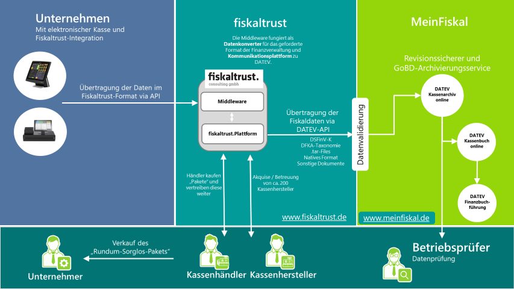
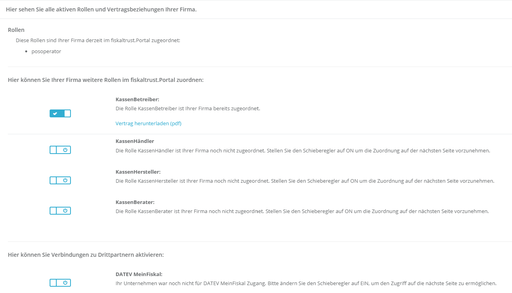
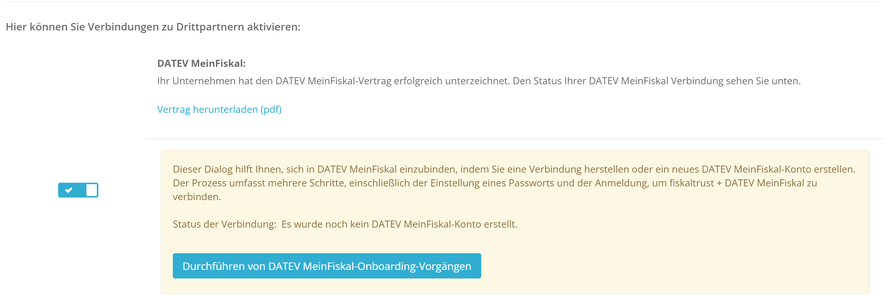
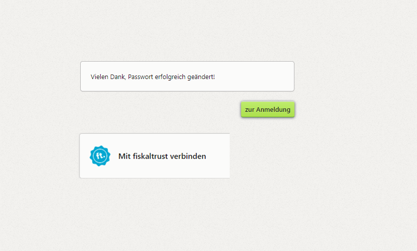
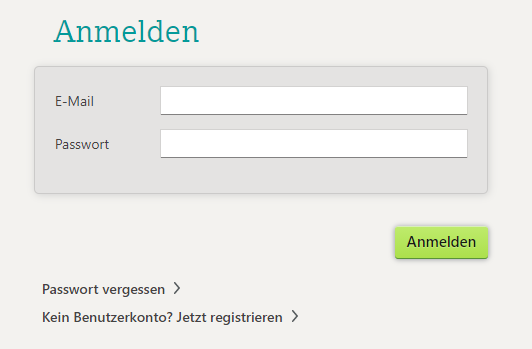

# MeinFiskal

## Produktbeschreibung

Das Produkt "MeinFiskal" ist fester Bestandteil des "fiskaltrust.Sorglos" Produkt-Bundles, aber auch als optionales Einzelprodukt verfügbar. Vom fiskaltrust.Portal gelangen die Daten über eine automatisierte Schnittstelle auf die "[DATEV  MeinFiskal](https://www.meinfiskal.de/)" Plattform, wodurch die inkludierten Grundservices „DATEV Kassenarchiv online“ und die „DATEV Kassenbuch-Schnittstelle“ genutzt werden können.

### Prozessbeschreibung

Der Kassenhändler aktiviert im fiskaltrust.Portal die Funktion DATEV MeinFiskal, indem er den Nutzungsvertrag (Link zum Nutzungsvertrag fehlt noch !) zeichnet.
Die Kundendaten wie Email-Adresse und Steuernummer(St.-ldNr. oder USt-ldNr) werden zwischen dem fiskaltrust.Portal und der "[DATEV  MeinFiskal](https://www.meinfiskal.de/)" Plattform ausgetauscht. Bei der DATEV wird ein MeinFiskal Benutzerkonto mit einem automatisiert erstellten Kennwort und derselben Email-Adresse wie beim fiskaltrust.Portal angelegt. 
Der KassenHändler ändert das Kennwort des DATEV Benutzerkontos und bestätigt im fiskaltrust.Portal die Datenübertragung zwischen fiskaltrust und DATEV. Der KassenBetreiber erhält eine Willkommens-E-Mail von DATEV MeinFiskal und kann die inkludierten Dienstleistungen DATEV KAssenarchiv online und DATEV Kassenbuch-Schnittstelle nutzen.

fiskaltrust übernimmt die Generierung der gesetzlich vorgeschriebenen Datenformate (DSFinV-K, DFKA-Taxonomie, .tar-Files, natives Format, sonstige Dokumente), sowie die Anbindung und Datenübermittlung an DATEV MeinFiskal über das fiskaltrust.Portal. Eine Anbindung an DATEV MeinFiskal durch den KassenHersteller ist für den KassenHändler bzw. den KassenBetreiber nicht mehr notwendig.

! Ersetzen durch eigenes?

## Einrichtung

### Voraussetzungen

Der KassenBetreiber ist bereits im fiskaltrust.Portal aktiv, hat den AGB der fiskaltrust und der KassenBetreiber-Nutzungsvereinbarung zugestimmt, seine Stammdaten kontrolliert und der KassenHändler hat die Berechtigung Vertragsabschluss. Sollten diese Voraussetzungen nicht erfüllt sein, muß erst das [KassenBetreiber Onboarding](https://docs.fiskaltrust.cloud/docs/posdealers/rollout-doc/invitation-management) abgeschlossen werden oder der die Einrichtung vom KassenBetreiber selbst durchgeführt werden.

  
Prüfen der Voraussetzungen
  
&nbsp;

  1. Berechtigung Vertragsabschluss
  * Melden Sie Sich als KassenHändler im fiskaltrust.Portal an. 
  * Wechseln Sie zu PosOperator -> Übersicht. 
  * Geben Sie ggf. Filterkriterien ein, um die Suchergebnisse einzugrenzen und wählen Sie Suchen. 
  * Prüfen Sie mit dem Symbol bei Berechtigungen, ob ein Vertragsabschluss aktiv ist.
  * Wenn das Recht nicht aktiv ist, kontaktieren sie den KassenBetreiber, damit er Ihnen die Berechtigung erteilt.
  * Mit OK schließen Sie das Dialogfenster. 
2. Stammdaten
  * Wählen Sie bei Name den Link und wechseln Sie zum Account des Kassenbetreibers.
  * Wählen Sie Firma -> Stammdaten.
  * Kontrollieren Sie, ob jedes Pflichtfeld wie Name*, Adresse* ausgefüllt ist. 
  * Prüfen Sie auch, ob vor oder nach den Angaben keine Leerstellen eingegeben wurden. 
  * Kontrollieren Sie, ob entweder mit St.-ldNr. oder mit USt-ldNr. eine Gültigkeitsprüfung erfolgreich durchgeführt werden kann.
  * Sichern Sie Ihre Eingaben mit Speichern. 

&nbsp;

### Anleitung

1. Der KassenHändler aktiviert im Namen des KassenBetreibers die Funktion DATEV MeinFiskal im [fiskaltrust.Portal](https://portal-sandbox.fiskaltrust.de/AccountProfile).

Screenshot Funktion DATEV MeinFiskal 
  

&nbsp;

2. Der KassenHändler stimmt im Namen des KassenBetreibers dem Nutzungsvertrag, den AGBs und der Datenschutzerklärung DATEV MeinFiskal zu. Der KassenBetreibers erhält den unterschriebenen Vertrag per E-Mail.

3. Bei der Funktion DATEV MeinFiskal stehen ab jetzt der Nutzungsvertrag zum Download und eine Schaltfläche für das Durchführen des DATEV MeinFiskal-Onboarding zur Verfügung. Der KassenHändler klickt auf die Schaltfläche "Durchführen von DATEV MeinFiskal-Onboarding Vorgängen". Die Stammdaten werden von DATEV überprüft, eventuelle Fehler angezeigt und im Erfolgsfall wird automatisch ein DATEV MeinFiskal Benutzerkonto angelegt.

DATEV MeinFiskal-Onboarding 
  

&nbsp;

4. Das Dialogfenster von DATEV MeinFiskal zur Änderung des Kennworts wird angezeigt. Der KassenHändler setzt ein neues Kennwort und drückt "Speichern".

Screenshot DATEV Kennwortänderung 
  

&nbsp;

5. Dem KassenHändler wird die Bestätigung zur Änderung des Kennworts und ein Anmelde Button angezeigt. Der KassenHändler drückt auf den Anmelde Button.

Screenshot DATEV Kennwortänderung erfolgreich
  

&nbsp;

6. Der KassenHändler gibt im Anmeldedialog die DATEV MeinFiskal Anmeldedaten ein, also dieselbe Email-Adresse wie beim fiskaltrust.Portal und das zuvor geänderte Kennwort. Er bestätigt die Verbindung zwischen fiskaltrust und DATEV MeinFiskal. Mit diesem Schritt werden das fiskaltrust und Datev MeinFiskal Konto miteinander verbunden. 

Screenshot DATEV Anmeldung / Accounts verbinden
  

&nbsp;

7. Der KassenHändler hat sich erfolgreich auf der DATEV MeinFiskal Webseite angemeldet und wird aufgefordert, den Datenaustausch zwischen fikaltrust und DATEV MeinFiskal zu bestätigen. Der KassenHändler setzt den Haken bei der Checkbox und klickt auf den Bestätigen Button. Der Datenaustausch zwischen fiskaltrust und DATEV MeinFiskal ist nun aktiv. 

Screenshot DATEV Datenaustausch zustimmen 
  

! Screenshot fehlt noch

&nbsp;

8. Der KassenBetreiber erhält etwa eine Stunde später eine Willkommens-E-Mail mit allgemeinen Informationen und einem Link zur Kennwortänderung.

9. Der KassenBetreiber klickt auf den Link zur Kennwortänderung und ändert sein DATEV MeinFiskal Kennwort (siehe Screenshot unter Punkt 4). 
Der KassenBetreiber kann nun die inkludierten Dienstleistungen DATEV KAssenarchiv online und DATEV Kassenbuch-Schnittstelle nutzen.

## Troubleshooting

- Der KassenHändler kann den Nutzungsvertrag zu DATEV MeinFiskal nicht für den KassenBetreiber unterschreiben, da ihm die Berechtigung dazu fehlt. Der KassenHändler muss Kontakt zum KassenBetreiber aufnehmen, damit dieser ihm die notwendige Berechtigung erteilt.

- Der KassenHändler führt die Kennwortänderung in Schritt 3 nicht durch und kann sich nicht mehr bei DATEV MeinFiskal als KassenBetreiber anmelden. Nach spätestens 4 Tagen wird die Willkommens-E-Mail an den KassenBetreiber versendet. Um den Prozess mit Schritt 4 fortsetzen zu können, muss der KassenHändler Kontakt mit dem KassenBetreiber aufnehmen um das aktuelle Kennwort zu erhalten.

- Der KassenHändler kann sich nicht mehr auf der DATEV MeinFiskal anmelden, da er die Zugangsdaten nicht mehr hat. Er kann eine nochmalige E-Mail zur Kennwortänderung auf der DATEV MeinFiskal Webseite nicht eigenständig anfordern. Dies ist nur über den KassenBetreiber möglich, sobald dieser die Willkommens-E-Mail mit dem Link zur Kennwortänderung auf der DATEV MeinFiskal Webseite erhalten hat.

- Der KassenHändler kann den Verknüpfungsvorgang zwischen fiskaltrust und DATEV MeinFiskal nicht abschliessen, weil bei der Eingabe von Benutzername und Kennwort bei DATEV MeinFiskal in Schritt 6 der falsche Benutzername (nicht dieselbe Email-Adresse wie beim fiskaltrust.Portal) angegeben wurde. Der KassenHändler muss sich an den fiskaltrust Support wenden, damit die falsche Verknüpfung wieder gelöscht werden kann.
