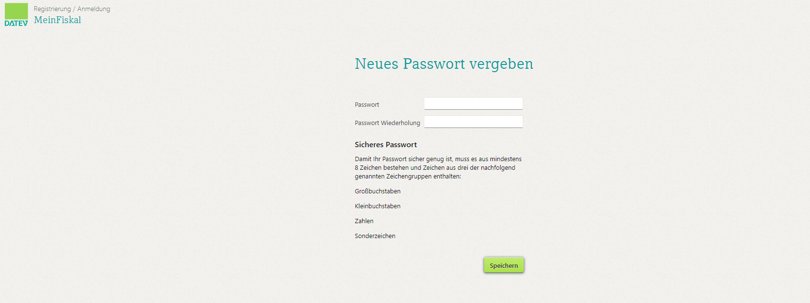
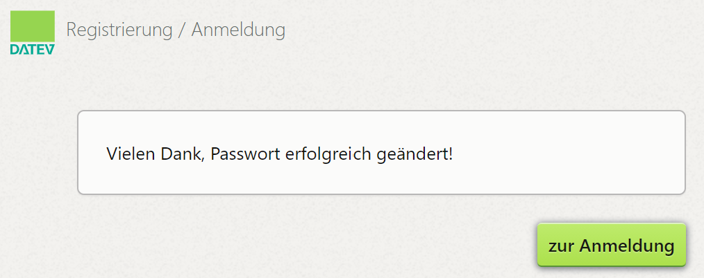

# Anmerkungen Entwicklung
beinhaltete Produkte, Kassenarchiv auch enthalten (?)
Beschreibung von meinFiskal auf deren Webseite nachlesen
Exporte
Vertrag in Beschreibung(?)
Einrichtung bei uns (nicht vergessen Full Right + Vertragsunterzeichnungsrecht)
(?) AV drangehängt (?)

Dürfen wir das Einzelprodukt MeinFiskal schon erwähnen, hier steht im Vertrag ja das über den Going Live Termin ja DATEV informiert werden muss under vorher keine Kommunikation dazu stattfindet ?

# MeinFiskal

## Produktbeschreibung

Das Produkt "MeinFiskal" ist fester Bestandteil des "fiskaltrust.Sorglos" Produkt-Bundles, aber auch als optionales Einzelprodukt verfügbar. Von der fiskaltrust.Plattform gelangen die Daten über eine automatisierte Schnittstelle auf die "[DATEV  MeinFiskal](https://www.meinfiskal.de/)" Plattform, wodurch die inkludierten Grundservices „DATEV Kassenarchiv online“ und die „DATEV Kassenbuch-Schnittstelle“ genutzt werden können.

### Prozessbeschreibung

Der Kassenhändler aktiviert im fiskaltrust.Portal die Rolle DATEV MeinFiskal und zeichnet den . Die Kundendaten werden zwischen fiskaltrust und DATEV ausgetauscht und ein DATEV MeinFiskal Account angelegt. Der KassenHändler ändert das Kennwort des DATEV Accounts und bestätigt im fiskaltrust.Portal die Datenübertragung zwischen fiskaltrust und DATEV. Der KassenBetreiber erhält eine Willkommens-E-Mail von DATEV MeinFiskal, und kann die inkludierten Dienstleistungen DATEV KAssenarchiv online und DATEV Kassenbuch-Schnittstelle nutzen.

fiskaltrust übernimmt die Generierung der gesetzlich vorgeschriebenen Datenformate (DSFinV-K, DFKA-Taxonomie, .tar-Files, natives Format, sonstige Dokumente), sowie die Anbindung und Datenübermittlung an DATEV MeinFiskal über die fiskaltrust.Plattform. Eine Anbindung an DATEV MeinFiskal durch den KassenHersteller ist für den KassenHändler bzw. den KassenBetreiber nicht mehr notwendig.

! Ersetzen durch eigenes?

## Einrichtung

### Voraussetzungen

Der KassenBetreiber ist bereits im Fiskaltrust-Portal aktiv, hat den Fiskaltrust-AGBs und der KassenBetreiber-Nutzungsvereinbarung zugestimmt und der KassenHändler hat das Recht Vertragsabschluss. Sollten diese Voraussetzungen nicht erfüllt sein, muß erst das [KassenBetreiber Onboarding](https://docs.fiskaltrust.cloud/docs/posdealers/rollout-doc/invitation-management) abgeschlossen werden.

1. Der KassenHändler aktiviert im Namen des KassenBetreibers die Rolle DATEV MeinFiskal im [Portal](https://portal-sandbox.fiskaltrust.de/AccountProfile).

2. Der KassenHändler stimmt im Namen des KassenBetreibers der  von MeinFiskal zu. Der KassenBetreibers erhält den unterschriebenen Vertrag per E-Mail.

! Link zum Vertrag ?

? Kann es hier zu Problemen/Fehlermeldungen kommen, wenn die Daten an DATEV gesendet werden ?

3. Für den KassenBetreiber wird automatisch ein DATEV MeinFiskal Benutzerkonto angelegt und das fiskaltrust.Portal bietet dem KassenHändler einen Link an, über den das Passwort geändert werden kann.

! Screenshot

4. Der KassenHändler klickt auf den Link und wird auf die DATEV MeinFiskal-Seite zum Setzen eines Passwortes geleitet. Der KassenHändler setzt ein neues Passwort und drückt "Speichern".

5. Dem KassenHändler wird eine Bestätigung der Passwort Änderung und ein Hersteller-spezifischer Link durch z.B. ein Fiskaltrust-Icon angezeigt. Der KassenHändler drückt auf den Link und gelangt wieder zum fiskaltrust.Portal.

6. Der KassenHändler drückt im fiskaltrust.Portal den Button "Mit MeinFiskal verbinden". 

! Screenshot

7. Der KassenHändler gibt in dem sich öffnenden Anmeldedialog seine DATEV MeinFiskal Anmeldedaten ein und bestätigt die Verbindung zwischen fiskaltrust und DATEV MeinFiskal. Der Datenaustausch zwischen den Plattformen fiskaltrust und DATEV MeinFiskal ist nun aktiv.

8. Der KassenBetreiber erhält 1 Stunde später eine Willkommens-E-Mail mit allgemeinen Informationen und einem Link zur Kennwortänderung.

! Screenshot anpassen / Name Adresse anonymisieren wenn mit Testdaten nicht möglich?

9. Der KassenBetreiber klickt auf den Link zur Kennwortänderung und ändert sein DATEV MeinFiskal Kennwort (siehe Screenshot unter Punkt 4). 
Der KassenBetreiber kann nun die inkludierten Dienstleistungen DATEV KAssenarchiv online und DATEV Kassenbuch-Schnittstelle nutzen.

## Troubleshooting

- Der KassenHändler kann den Nutzungsvertrag zu DATEV MeinFiskal nicht für den KassenBetreiber unterschreiben, da ihm die Berechtigung dazu fehlt.

? Wie bekommt er sie ?

- Der KassenHändler führt die Kennwortänderung in Schritt 3 nicht durch und kann sich nicht mehr bei der DATEV MeinFiskal Plattform als KassenBetreiber anmelden. Nach spätestens 4 Tagen wird die Willkommens-E-Mail an den KassenBetreiber versendet. Um den Prozess mit Schritt 4 fortsetzen zu können, muss der KassenHändler Kontakt mit dem KassenBetreiber aufnehmen um das aktuelle Kennwort zu erhalten.

- Der KassenHändler kann sich nicht mehr auf der DATEV MeinFiskal Plattform anmelden, da er die Zugangsdaten nicht mehr hat. Er kann eine nochmalige E-Mail zur Kennwortänderung auf der DATEV MeinFiskal Plattform nicht eigenständig anfordern. Dies ist nur über den KassenBetreiber möglich, sobald dieser die Willkommens-E-Mail mit dem Link zur Kennwortänderung auf der DATEV MeinFiskal Plattform erhalten hat.