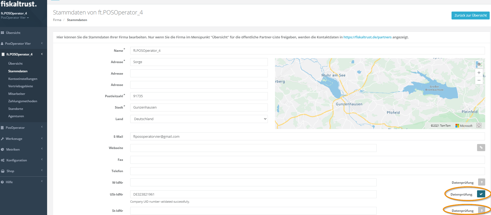
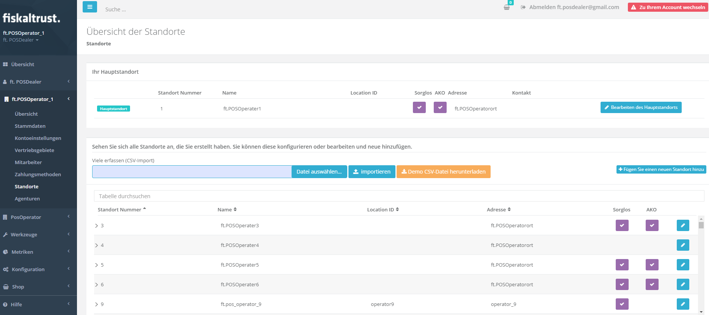
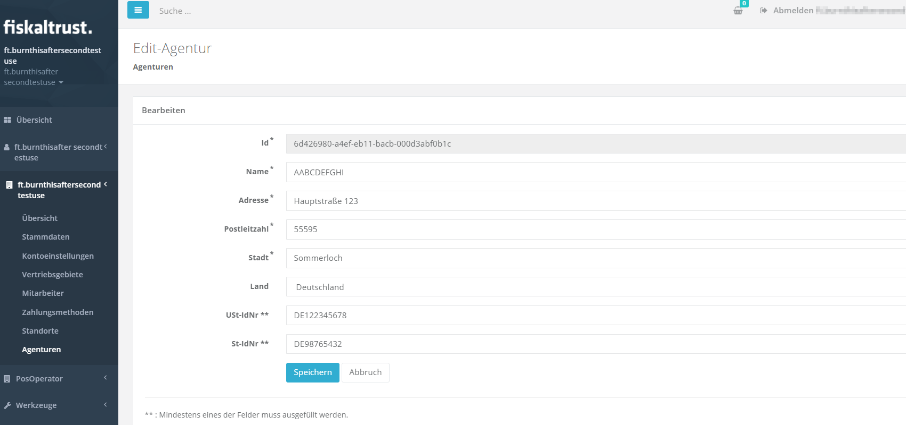
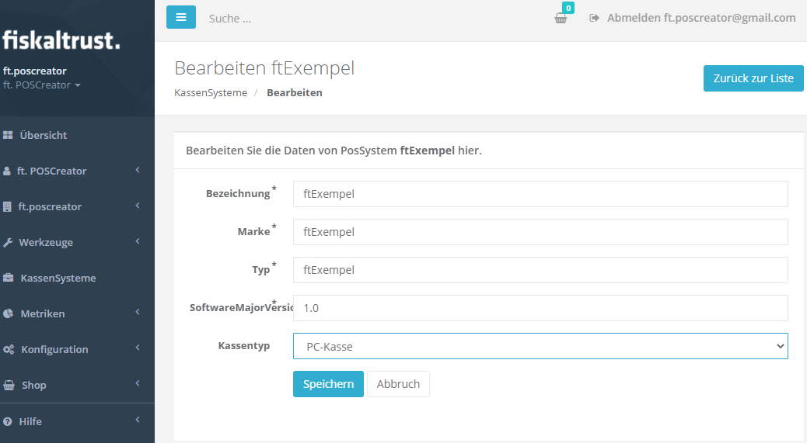

# Stammdaten eines KassenBetreibers

Dieses Dokument beschreibt Anforderungen an die Stammdaten eines KassenBetreibers wie Daten des Unternehmens (im weiteren Firma genannt) oder Benutzerdaten. Diese Daten müssen im fiskaltrust.Portal mindestens eingegeben, kontrolliert und gepflegt werden. Nur so sind Produkte und Features von fiskaltrust zu nutzen. Weiter gelingen nur mit korrekt eingegebenen Daten auch Exporte. 
Daten, welche in diesem Dokument nicht aufgelistet sind:

* werden von fiskaltrust entweder im Hintergrund automatisiert erzeugt 
(z.B. TSE Daten für den DSFinV-K Export) oder
* sind gesetzlich nicht gefordert, oder
* sind optional und somit für die ordnungsgemäße Funktion nicht zwingend erforderlich. 

Das Bereitstellen durch Anlegen oder Import wird beschrieben. Weiter, wer bzw. welche Rolle (KassenHersteller, KassenHändler, KassenBetreiber, Steuerberater) für die Erzeugung und Wartung dieser Daten verantwortlich ist. Ebenso wird die Aktualisierung von Daten erläutert.

## Firmendaten

- [ ] KassenHändler laden KassenBetreiber im Rahmen des [Einladungsmanagements](https://docs.fiskaltrust.cloud/de/docs/posdealers/rollout-doc/invitation-management#einladungsmanagement) zur Anmeldung und Nutzung des fiskaltrust.Portals ein.
- [ ] Nach dem [Anlegen oder dem Import der Daten der KassenBetreiber](#Firmendaten-bereit-stellen) können KassenHändler unter [<kbd>PosOperator</kbd>](https://portal.fiskaltrust.de/PosOperator/PosOperators) &rarr; <kbd>Einladungen</kbd> &rarr; <kbd>Bearbeiten</kbd> die Stammdaten der KassenBetreiber kontrollieren und ergänzen. Die KassenBetreiber können die Stammdaten unter [Firma]&rarr; [<kbd>Stammdaten</kbd>](https://portal.fiskaltrust.de/AccountProfile/Edit) nach der Erstanmeldung im fiskaltrust.Portal auch selbst ergänzen.
- [ ] Spätestens **vor** dem ersten Einkauf durch KassenBetreiber oder KassenHändler **müssen** die Stammdaten korrekt und vollständig eingetragen sein. 

 

- [ ] Beachten Sie im Account des KassenBetreibers (unter [Firma]&rarr; [
    <kbd>Stammdaten</kbd>](https://portal.fiskaltrust.de/AccountProfile/Edit)) die [Datenprüfung](#Datenpruefung). Diese kann helfen, den Eintrag von (Firmen-)Name und Umsatzsteuer- Identifikationsnummer (USt-IdNr) bzw. Steuer-Identifikationsnummer (St-IdNr) zu prüfen.  

### Daten der Firmen bereit stellen

| **Option**                                           | Beschreibung                                                                                                                                                                                                                                                                                                                                                                                                            | Rechtemanagement                                                                                                                                                                                    | **Vorteile**                                                                                                                                                                                                        | **Nachteile**                                                                                                                      |
|------------------------------------------------------|-------------------------------------------------------------------------------------------------------------------------------------------------------------------------------------------------------------------------------------------------------------------------------------------------------------------------------------------------------------------------------------------------------------------------|-----------------------------------------------------------------------------------------------------------------------------------------------------------------------------------------------------|---------------------------------------------------------------------------------------------------------------------------------------------------------------------------------------------------------------------|------------------------------------------------------------------------------------------------------------------------------------|
| **manuelle Erstellung**                              | Die Daten werden manuell im fiskaltrust.Portal unter <kbd>PosOperator</kbd>  &rarr; <kbd>Einladung</kbd> &rarr;  <kbd>Hinzufügen</kbd> eingetragen. Die Empfänger der E-Mail werden eingeladen, sich im fiskaltrust.Portal zu registrieren.                                                                                                                                                                        | <kbd>Schreiben/Lesen</kbd>  Die erforderlichen Berechtigungen werden durch den KassenBetreiber beim Akzeptieren der Einladung bestätigt.                                                  | Geringer Aufwand für KassenHändler bei einer kleinen Anzahl von KassenBetreibern                                                                                                                                    | Der KassenHändler kann den Rollout Prozess nicht weiterführen, solange die Einladungen vom KassenBetreiber nicht bestätigt wurden. |
| **Import per CSV-Datei**                             | Die Daten werden mit einer CSV Datei importiert. Dazu steht unter <kbd>PosOperator</kbd> &rarr; <kbd>Einladungen</kbd> eine **Demo CSV-Datei** für die Masseneinladung von KassenBetreibern zur Verfügung.  Die Empfänger der E-Mail werden eingeladen, sich im fiskaltrust.Portal zu registrieren.                                                                                                                | <kbd>Schreiben/Lesen</kbd>  Die erforderlichen Berechtigungen werden durch den KassenBetreiber beim Akzeptieren der Einladung bestätigt.                                                  | Eine größere Anzahl an Betreiber wird in einem Schritt erstellt und ins fiskaltrust.Portal eingeladen.                                                                                                              | Der KassenHändler kann den Rollout Prozess nicht durchführen, wenn vom KassenBetreiber die Einladung nicht bestätigt wurden.       |
| **zusätzliche Rolle: KassenHändler Auto-Invitation** | Im ersten Schritt holt sich der KassenHändler bei seinen KassenBetreibern das Einverständnis ein, in deren Namen im fiskaltrust.Portal tätig sein zu dürfen. Die Daten werden mit einer CSV Datei importiert. Die Empfänger der darin enthaltenen E-Mailadressen werden per E-Mail über den erfolgreichen Abschluss des Prozesses informiert und die Vertragsunterlagen werden zur Dokumentation übermittelt. | <kbd>Schreiben/Lesen</kbd>   inkl. Vertragsabschluss  Die erforderlichen Berechtigungen müssen vom KassenHändler **vorab** und **außerhalb** des fiskaltrust.Portals eingeholt werden. | Eine größere Anzahl an Betreiber wird in einem Schritt erstellt und ins fiskaltrust.Portal eingeladen. Der Registrierungsprozess für Betreiber entfällt und stellt kein Hindernis für einen Rollout dar.  |                                                                                                                                    |

### Firmendaten im Überblick

| Daten                        | Exporte1                                                                           | Finanzamt- meldung2 | fiskaltrust.Portal | Anmerkung                                                                                                                                                                                                                                                                                                        |
|------------------------------|-----------------------------------------------------------------------------------------------|-----------------------------------|--------------------|------------------------------------------------------------------------------------------------------------------------------------------------------------------------------------------------------------------------------------------------------------------------------------------------------------------|
| **Name***         | Pflicht                                                                                       |                                   | Pflicht            | Bitte beachten Sie, dass der (Firmen-)**Name**  mit dem exakt gleichem Firmenwortlaut im Unternehmensregister (Deutschland) / Firmenbuch (Österreich) / SIREN (Frankreich) übereinstimmen muss.                                                                                                                  |
| **Adresse***      |                                                                                               |                                   | Pflicht            | Dieser Feldinhalt wird bei der Rechnungsanschrift als Straßenangabe verwendet.                                                                                                                                                                                                                                   |
| **Adresse**                  |                                                                                               |                                   |                    | Dieses Feld dient für Adresszusätze zum weiteren Präzisieren der Rechnungsanschrift.                                                                                                                                                                                                                             |
| **Adresse**                  |                                                                                               |                                   |                    | Dieses Feld dient für weitere Adresszusätze zum Präzisieren des Adressaten.                                                                                                                                                                                                                                      |
| **Postleitzahl*** | Pflicht                                                                                       |                                   | Pflicht            | Postleitzahl für Rechnungsanschrift                                                                                                                                                                                                                                                                              |
| **Stadt***        | Pflicht                                                                                       |                                   | Pflicht            | Ortsangabe für Rechnungsanschrift                                                                                                                                                                                                                                                                                |
| **Land**                     | Pflicht                                                                                       |                                   | Pflicht            | Wählen Sie ein Land aus der Auswahlleiste, falls der bereits eingestellte Wert nicht passen sollte.                                                                                                                                                                                                              |
| **E-Mail**                   |                                                                                               |                                   | Pflicht            | Die E-Mailadresse dient als Benutzername. Dieser kann nur bei [Benutzername] &rarr; <kbd>Benutzername ändern</kbd> geändert werden.  Die E-Mailadresse wird weiter zum Versand von Auftragsbestätigungen und Rechnungen verwendet.  Der Versand an unterschiedliche E-Mailadressen wird nicht unterstützt. |
| **Webseite**                 |                                                                                               |                                   |                    | Hier können Informationen zur Webseite des Accountinhabers eingegeben werden.                                                                                                                                                                                                                                    |
| **Fax**                      |                                                                                               |                                   |                    | Hier kann der Faxanschluss des Accountinhabers eingegeben werden..                                                                                                                                                                                                                                               |
| **Telefon**                  |                                                                                               |                                   |                    | Hier kann die Telefonnummer des Accountinhabers eingegeben werden..                                                                                                                                                                                                                                              |
| **W-IdNr**                   |                                                                                               |                                   |                    | **Wirtschafts-Identifikationsnummer**, in der **Demo CSV-Datei** für die Masseneinladung von KassenBetreibern nicht vorhanden.                                                                                                                                                                                   |
| **USt-IdNr**                 | Entweder die St.-ldNr. oder die **USt-ldNr.** muss korrekt eingegeben oder importiert werden. |                                   |                    | Umsatzsteuer-Identifikationsnummer, in der **Demo CSV-Datei** für die Masseneinladung  von KassenBetreibern **AccountUStIdNr** benannt.                                                                                                                                                                          |
| **St-IdNr**                  | Entweder die **St.-ldNr.** oder die USt-ldNr. muss korrekt eingegeben oder importiert werden. |                                   |                    | Steuer-Identifikationsnummer, in der **Demo CSV-Datei** für die Masseneinladung **AccountStIdNr** benannt.                                                                                                                                                                                                       |
1 = DSFinV-K/DFKA- Export - Taxonomie Version 2.1
2 = Finanzamtmeldung (vom Gesetzgeber noch nicht final definiert)

### Datenprüfung
Für die Anmeldung Ihrer Kassen- und Aufzeichnungssysteme und zur korrekten Datenweitergabe sollte eine **Datenprüfung** erfolgreich durchgeführt werden. Diese prüft ab, ob der  bei **Name*** eingegebene Name der Firma exakt übereinstimmt mit dem Firmenwortlaut im Unternehmensregister (Deutschland) / Firmenbuch (Österreich) / SIREN (Frankreich). 
> Weiter wird entweder die **St.-ldNr.** oder die **USt-ldNr.** abgeglichen, weswegen auch eine von diesen beiden korrekt angegeben werden muss. Dabei erzeugen Leerstellen wie bei DE 123 456 789 Fehler bei der Prüfung. Richtig ist DE123456789.
>  Bei Kapitalgesellschaften aus Deutschland scheitert die **Datenprüfung**. Bei diesen wird zwar die Identifikationsnummer (USt-Idnr.) geprüft und als korrekt zurück gemeldet. Aber beim Firmennamen wird kein Firmenname, sondern nur "---" zurückgemeldet. Als Workaround können Sie den Firmennamen vor der Prüfung durch drei Minus "---" ersetzen. Danach prüfen Sie die Umsatzsteuer-Identifikationsnummer (USt-Idnr.) erneut. Bei positiver Bestätigung den komplette Firmennamen wieder einsetzen und auf eine erneute Datenprüfung verzichten.

## Benutzerangaben

- [ ] Nachdem [Anlegen oder dem Import der Daten der KassenBetreiber](#Firmendaten-bereit-stellen) können diese durch den KassenHändler unter [<kbd>PosOperator</kbd>](https://portal.fiskaltrust.de/PosOperator/PosOperators) &rarr; <kbd>Einladungen</kbd> &rarr; <kbd>Bearbeiten</kbd> kontrolliert und ergänzt werden. 
- [ ] Die KassenBetreiber können nach der Erstanmeldung im fiskaltrust.Portal die Benutzerangaben unter [Benutzername]&rarr; [<kbd>Daten</kbd>](https://portal.fiskaltrust.de/ContactProfile/EditProfile) auch selbst bearbeiten. Die Pflichtangaben sind zur Nutzung des fiskaltrust.Portals notwendig, alle anderen Angaben optional. 

### Daten der Benutzer bereit stellen

Mit dem [Anlegen oder dem Import der Daten der KassenBetreiber](#Firmendaten-bereit-stellen) werden die Benutzerdaten festgelegt. Bei der Erstanmeldung der Benutzer dient die E-Mailadresse als Benutzername, ein Passwort wird vom KassenBetreiber selbst vergeben.
### Benutzerangaben im Überblick
| Daten                    | Exporte1 | Finanzamt- meldung2 | fiskaltrust.Portal | Anmerkung                                                                                                                                                                                                                      |
|--------------------------|---------------------|-----------------------------------|--------------------|--------------------------------------------------------------------------------------------------------------------------------------------------------------------------------------------------------------------------------|
| **Anrede**               |                     |                                   |                    |                                                                                                                                                                                                                                |
| **Titel**                |                     |                                   |                    |                                                                                                                                                                                                                                |
| **Vorname***  |                     |                                   | Pflicht            |                                                                                                                                                                                                                                |
| **Nachname*** |                     |                                   | Pflicht            |                                                                                                                                                                                                                                |
| **Suffix**               |                     |                                   |                    |                                                                                                                                                                                                                                |
| **Adresse...**           |                     |                                   | optional           |                                                                                                                                                                                                                                |
| **E-Mail***   |                     |                                   | Pflicht            | Die E-Mailadresse dient als Benutzername.  Dieser kann nur bei [Benutzername] &rarr; <kbd>Benutzername ändern</kbd> geändert werden.                                                                                        |
| **Kontaktangaben...**    |                     |                                   | optional           |                                                                                                                                                                                                                                |
| **Sprache**              |                     |                                   |                    | Die im fiskaltrust.Portal verwendete Sprache wird mit <kbd>Automatisch erkennen</kbd> aus den Systemeinstellungen übernommen. Die Sprache kann hier geändert werden, Änderungen werden nach dem <kbd>Speichern</kbd> wirksam.. |
| **Zeitzone**             |                     |                                   |                    | Die im fiskaltrust.Portal verwendete Zeitzone wird mit <kbd>Detect</kbd> aus den Systemeinstellungen übernommen. Die Zeitzone kann hier geändert werden, Änderungen werden nach dem <kbd>Speichern</kbd> wirksam.              |

1 = DSFinV-K/DFKA- Export - Taxonomie Version 2.1
2 = Finanzamtmeldung (vom Gesetzgeber noch nicht final definiert)

## Standort (Outlet)

- [ ] KassenHändler oder KassenBetreiber legen im Account des KassenBetreibers Standorte an.
- [ ] Die Angaben zu einzelnen Standorten sind im Account des KassenBetreibers unter [Firma] &rarr; [<kbd>Standorte</kbd>](https://portal.fiskaltrust.de/AccountOutlet) zu finden.

- [ ] Spätestens **vor** dem ersten Einkauf durch KassenBetreiber oder KassenHändler mit Versand von Hardware an einen Standort  **müssen** die Angaben zum Standort korrekt und vollständig eingetragen sein. 

### Daten der Standorte bereit stellen

Die Angaben zu einzelnen Standorten können im Account des KassenBetreibers unter [Firma] &rarr; [<kbd>Standorte</kbd>](https://portal.fiskaltrust.de/AccountOutlet) manuell angelegt werden. Für den Import mehrerer Standorte steht eine **Demo CSV-Datei** zur Verfügung.

| Option              | Beschreibung                                                                                                                                                                                                                                       | Empfehlung                                              |
|---------------------|----------------------------------------------------------------------------------------------------------------------------------------------------------------------------------------------------------------------------------------------------|---------------------------------------------------------|
| **manuelle Anlage** | Standorte des KassenBetreibers werden vom KassenHändler manuell im Account des KassenBetreibers angelegt.                                                                                                                                          | Empfohlen für weniger als 25 Standorte eines Betreibers |
| **CSV Import**      | Import von Standorten mit Hilfe einer **Demo CSV-Datei**. Der Vorgang ist beim [Einladungsmanagement](https://docs.fiskaltrust.cloud/de/docs/posdealers/rollout-doc/invitation-management#standorte-f%C3%BCr-kassenbetreiber-anlegen) beschrieben. | Empfohlen für mehr als 25 Standorte eines Betreibers    |

### Standorte im Überblick

 | Daten                           | Exporte1 | Finanzamt- meldung2 | fiskaltrust.Portal | Anmerkung                                                                                                                                                                                                                                       |
 |---------------------------------|---------------------|-----------------------------------|--------------------|-------------------------------------------------------------------------------------------------------------------------------------------------------------------------------------------------------------------------------------------------|
 | **Name***            |                     |                                   | Pflicht            |                                                                                                                                                                                                                                                 |
 | **Standort Nummer*** |                     |                                   | Pflicht            | Die 1 und 2 sind für den Hauptstandort belegt. Sie können Nummern ab 3 aufwärts vergeben. In der **Demo CSV-Datei** für den Massenimport ist das Feld **OutletNumber** benannt.                                                                 |
 | **Location ID**                 |                     |                                   |                    | Feld für  Steuer-Identifikationsnummer, in der **Demo CSV-Datei** für den Massenimport **LocationId** benannt.                                                                                                                                  |
 | **Addresse***        | Pflicht             |                                   |                    | Dieser Feldinhalt wird bei der Lieferanschrift als Straßenangabe verwendet.                                                                                                                                                                     |
 | **Postleitzahl***    | Pflicht             |                                   |                    |                                                                                                                                                                                                                                                 |
 | **Stadt***           | Pflicht             |                                   |                    |                                                                                                                                                                                                                                                 |
 | **Bundesland**                  |                     |                                   |                    |                                                                                                                                                                                                                                                 |
 | **Bezirk**                      |                     |                                   |                    |                                                                                                                                                                                                                                                 |
 | **Land**                        |                     |                                   |                    |                                                                                                                                                                                                                                                 |
 | **Kontaktname**                 |                     |                                   |                    |                                                                                                                                                                                                                                                 |
 | **Telefon**                     |                     |                                   |                    |                                                                                                                                                                                                                                                 |
 | **Fax**                         |                     |                                   |                    |                                                                                                                                                                                                                                                 |
 | **_Zuständiges Finanzamt_**     |                     | _Pflicht_                         |                    | _Wird für die automatisierte Finanzamtmeldung der TSE-Kasse benötigt.  Feld ist nicht im CSV Import für die Bulk-Import von KassenBetreiber Outlets enthalten! _ _**Feature ist von fiskaltrust noch nicht zur Verfügung gestellt.**_ |

1 = DSFinV-K/DFKA- Export - Taxonomie Version 2.1
2 = Finanzamtmeldung (vom Gesetzgeber noch nicht final definiert)

## Agenturen 

- [ ] Vertreiben KassenBetreiber Produkte "im Auftrag von" anderen Unternehmen, werden diese als **Agenturen** festgelegt.
- [ ] Die Angaben zu Agenturen sind im Account des KassenBetreibers unter [Firma] &rarr; [<kbd>Agentur</kbd>](https://portal.fiskaltrust.de/AccountAgency) zu finden. 

### Agentur-Daten bereit stellen

Agenturen können im Account des KassenBetreibers unter [Firma] &rarr; [<kbd>Agenturen</kbd>](https://portal.fiskaltrust.de/AccountAgency) manuell angelegt werden.   Mit der Schaltfläche <kbd>Bearbeiten</kbd> können diese auch nachträglich geändert werden.

### Agentur-Daten im Überblick
 | Daten                        | Exporte1 | Finanzamt- meldung2 | fiskaltrust.Portal | Anmerkung                                                                                           |
 |------------------------------|---------------------|-----------------------------------|--------------------|-----------------------------------------------------------------------------------------------------|
 | **Id***           |                     |                                   | Pflicht            | Die **Id** wird automatisch vergeben und kann nachträglich nicht geändert werden.                   |
 | **Name***         |                     |                                   | Pflicht            |                                                                                                     |
 | **Addresse***     | Pflicht             |                                   |                    | Dieser Feldinhalt dient als Straßenangabe.                                                          |
 | **Postleitzahl*** | Pflicht             |                                   |                    |                                                                                                     |
 | **Stadt***        | Pflicht             |                                   |                    |                                                                                                     |
 | **Land**                     |                     |                                   |                    | Wählen Sie ein Land aus der Auswahlleiste, falls der bereits eingestellte Wert nicht passen sollte. |
 | **USt-IdNr****    |                     |                                   |                    | Mindestens eines der Felder,  **USt-IdNr** oder St-IdNr **muss** ausgefüllt werden.              |
 | **St-IdNr****     |                     |                                   |                    | Mindestens eines der Felder,  USt-IdNr oder **St-IdNr** **muss** ausgefüllt werden.              |

1 = DSFinV-K/DFKA- Export - Taxonomie Version 2.1

2 = Finanzamtmeldung (vom Gesetzgeber noch nicht final definiert)

## KassenSysteme (POS-System)

- [ ] KassenHersteller erstellen KassenSysteme im fiskaltrust.Portal unter [<kbd>KassenSysteme</kbd>](https://portal.fiskaltrust.de/POSSystem).
- [ ] Jeder Beleg eines KassenSystem wird eindeutig signiert. Diese Signatur enthält unter anderem Typ und Softwareversion des KassenSystems.
- [ ] Typ und Softwareversion des KassenSystems werden mit Hilfe der [ftPosSystemId](https://docs.fiskaltrust.cloud/de/docs/poscreators/middleware-doc/general/data-structures#receipt-request) im sign-request erfasst.
- [ ] Die Kassenseriennummer wird bei der Erstellung einer Queue durch den KassenHändler über das Feld <kbd>CashBox Identification </kbd>definiert.
- [ ] **Ohne diese Angaben zum KassenSystem sind die (archivierten) Belegdaten und die darauf basierenden Exporten (z.B. DSFinV-K Export)** unvollständig.

### KassenSystem im Überblick
 | Daten                         | Exporte1 | Finanzamt- meldung2 | fiskaltrust.Portal | Anmerkung                                                                                                                                                                      |
 |-------------------------------|---------------------|-----------------------------------|--------------------|--------------------------------------------------------------------------------------------------------------------------------------------------------------------------------|
 | **Bezeichnung***   |                     |                                   | Pflicht            |                                                                                                                                                                                |
 | **Marke***         | Pflicht             |                                   |                    |                                                                                                                                                                                |
 | **Kassentyp**      |                     |                                   |                    |                                                                                                                                                                                |
 | **Kassen-Seriennummer**       | Pflicht             |                                   |                    | Die <kbd>CashBox Identification</kbd>, welche bei der Erstellung einer Queue definiert wird, wird auch für die Kassenseriennummer verwendet und **muss daher eindeutig sein**. |
 | **Terminal-ID**               | Pflicht             |                                   |                    | sign-request vom Hersteller                                                                                                                                                    |
 | **Terminal-Software Version** | Pflicht             |                                   |                    | Als <kbd>Major Software Version </kbd> wird die führende Ziffer der fiskaltrust.Middlewareversion verwendet, die der Erstellung des POS-Systems verwendet wurde.               |

1 = DSFinV-K/DFKA- Export - Taxonomie Version 2.1
2 = Finanzamtmeldung (vom Gesetzgeber noch nicht final definiert)

## Verantwortlichkeiten 

Nachfolgend wird beschrieben, welche Rolle bezüglich der Verwaltung der Stammdaten für welche Aktivitäten verantwortlich ist, und welche Rollen zu beteiligen sind.

### Begriffe

- **Responsible (R)** – verantwortlich (Durchführungsverantwortung), zuständig für die eigentliche Durchführung.  Die Person, die die Initiative für die Durchführung (auch durch Andere) gibt. Sie kann die Aktivität auch selbst durchführen. Wird auch als Verantwortung im disziplinarischen Sinne interpretiert.
- **Accountable (A)** – rechenschaftspflichtig (Kosten-, bzw. Gesamtverantwortung), verantwortlich im Sinne von „genehmigen“, „billigen“ oder „unterschreiben“.   Die Person, die im rechtlichen oder kaufmännischen Sinne die Verantwortung trägt. Wird auch als Verantwortung aus Kostenstellensicht interpretiert.
-  **Support (S)** – unterstützend.  Die Person kann eine unterstützende Rolle spielen oder Betriebsmittel zur Verfügung stellen. In Abgrenzung zu C (Consulted), welche primär Wissen beisteuert, wird S (Support) meist als eine Rolle gesehen, die dem R (Responsible) aktiv Arbeit abnimmt.
- **Consulted (C)** – konsultiert.   Eine Person, die vielleicht nicht direkt an der Umsetzung beteiligt ist, aber relevante Informationen für die Umsetzung hat und deshalb befragt werden soll oder muss.
- **Informed (I)** – zu informieren (Informationsrecht).   Eine Person, die Informationen über den Verlauf bzw. das Ergebnis der Tätigkeit erhält oder die Berechtigung besitzt, Auskunft zu erhalten.

### Verantwortlichkeiten im Überblick

| Stammdaten   | KassenHersteller | KassenHändler | KassenBetreiber | fiskaltrust | Steuerberater |
|--------------|------------------|---------------|-----------------|-------------|---------------|
| **Firma**    |                  | S             | R + A           | C           | I             |
| **Standort** |                  | S             | R + A           | C           | I             |
| **Kasse**    | R + A            | R + A*        |                 | S** + C     | I             |
| **Agentur**  |                  | S             | R + A           | C           | I             |

*Gilt nur für die Kassenseriennummer - Die <kbd>CashBox Identification</kbd>, welche bei der Erstellung einer Queue durch den KassenHändler definiert wird (R + A), wird auch für die Kassenseriennummer verwendet.

**Weitere für den DSFINV-K benötigte Daten werden durch fiskaltrust automatisiert erzeugt und zur Verfügung gestellt.

## Aktualisierung von Stammdaten

Geänderte Stamm- oder Benutzerdaten stehen nach dem Speichern im fiskaltrust.Portal sofort zur Verfügung. Für die weitere Verarbeitung geänderter Werte bis hin zu Exporten sind weiter Rebuild, Neustart und Kassenabschluss notwendig. Auch Änderungen der [<kbd>POS-Systeme</kbd>](https://portal.fiskaltrust.de/POSSystem) beim KassenHersteller erfordern einen Kassenabschluss.

### Aktualisierungen bereit stellen

Die Aktualisierung von Stamm- oder Benutzerdaten wird erst wirksam, nachdem weitere Bearbeitungsschritte durchgeführt wurden:
- [ ] Stamm- oder Benutzerdaten im fiskaltrust.Portal ändern
- [ ] Rebuild mit den betroffenen CashBoxen des KassenBetreibers
- [ ] Neustart des Launchers für die fiskaltrust.Middleware
- [ ] Kassenabschluss zur Aktualisierung der fiskaltrust.Middleware.

### Aktualisierung im Überblick

1. KassenHändler oder Kassenbetreiber ändern im fiskaltrust.Portal Werte wie [<kbd>Stammdaten</kbd>](https://portal.fiskaltrust.de/AccountProfile/Edit), [<kbd>Standorte</kbd>](https://portal.fiskaltrust.de/AccountOutlet) oder [<kbd>Agenturen</kbd>](https://portal.fiskaltrust.de/AccountAgency).
2. Die CashBox wird im fiskaltrust.Portal mit [<kbd>rebuild configuration</kbd>](https://portal.fiskaltrust.de/CashBox) aktualisiert.
3. Die fiskaltrust.Middleware wird beim KassenSystem neu gestartet. Der Launcher aktualisiert die lokale Konfiguration.  Damit gelten die neuen Stammdaten, werden für Exporte aber **ignoriert bis zum nächsten Kassenabschluss.**
4. Ein Tages-, Monats- oder Jahres-Abschluss-Beleg mit Stammdatenupdate wird von der Kasse an die fiskaltrust.Middleware gesendet. 
>  Ihr KassenHersteller sollte diese Funktion über einen sogenannten Tages-, Monats- oder Jahres-Abschluss-Beleg mit dem _ftReceiptCaseFlag_ [<kbd>0x0000000008000000</kbd>](https://docs.fiskaltrust.cloud/docs/poscreators/middleware-doc/germany/reference-tables/ftreceiptcase#ftreceiptcaseflag) ins Kassensystem integrieren.
 
Die Aktualisierung der Stammdaten wird erst nach einem Kassenabschluss mit diesem Beleg übernommen. Die neuen Daten erscheinen im DSFinV-K-Export des nächsten, darauf folgenden Abschlusses.

### Vertiefende Informationen

 [Massenupdate von CashBoxen](../04-after-sales/how-to-mass-update-configuration.md) 
