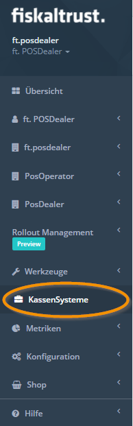

# Anforderungen an Stammdaten eines KassenBetreibers

Dieses Dokument beschreibt Anforderungen an die Stammdaten eines KassenBetreibers, welche mindestens eingepflegt und gewartet werden müssen, um Produkte und Features von fiskaltrust zu nutzen. 
Daten, welche in diesem Dokument nicht aufgelistet sind:

* werden von fiskaltrust entweder im Hintergrund automatisiert erzeugt (z.B. TSE Daten für den DSFinV-K Export) oder
* sind gesetzlich nicht gefordert, oder
* sind optional und somit für die ordnungsgemäße Funktion nicht zwingend erforderlich. 

Des weiteren wird beschrieben, wie diese Daten in das fiskaltrust.Portal eingepflegt werden können, und wer bzw. welche Rolle (KassenHersteller, KassenHändler, KassenBetreiber, Steuerberater) für die Erzeugung und Wartung dieser Daten verantwortlich ist.

## Stammdaten

Nach dem [Anlegen oder dem Import der Daten der KassenBetreiber](#Bereitstellung-der-Firmendaten) können diese durch den KassenHändler  unter <kbd>PosOperator</kbd> &rarr; <kbd>Einladungen</kbd> &rarr; <kbd>Bearbeiten</kbd> kontrolliert und ergänzt werden. 
Die KassenBetreiber können die Stammdaten (unter [Firmenname]&rarr; [[<kbd>Stammdaten</kbd>](https://portal-sandbox.fiskaltrust.de/AccountProfile/Edit)](https://portal-sandbox.fiskaltrust.de/AccountProfile/Edit)) nach der Erstanmeldung im fiskaltrust.Portal auch selbst ergänzen und prüfen lassen.
Spätestens vor dem ersten Einkauf durch KassenBetreiber oder KassenHändler **müssen** die Stammdaten korrekt und vollständig eingetragen sein. 

Beachten Sie im Account des KassenBetreibers (unter [Firmenname]&rarr; [[<kbd>Stammdaten</kbd>](https://portal-sandbox.fiskaltrust.de/AccountProfile/Edit)](https://portal-sandbox.fiskaltrust.de/AccountProfile/Edit)) zu Ihrer Unterstützung die Datenprüfung. Diese kann helfen, den Eintrag von (Firmen-)Name und Steuernummer zu prüfen.  
### Firma

| Daten                              | DSFinV-K/DFKA- Export - Taxonomie Version 2.1                                                                                                                                             | Finanzamtmeldung  (vom Gesetzgeber noch nicht final definiert) | fiskaltrust.Portal | Anmerkung                                                                                                                                                                                                                                                                                                               |
|------------------------------------|-------------------------------------------------------------------------------------------------------------------------------------------------------------------------------------------|---------------------------------------------------------------|------------------------------|-------------------------------------------------------------------------------------------------------------------------------------------------------------------------------------------------------------------------------------------------------------------------------------------------------------------------|
| **Name***               | Pflicht                                                                                                                                                                                   |                                                               |                              | Bitte beachten Sie, dass der (Firmen-)**Name**  mit dem exakt gleichem Firmenwortlaut im Unternehmensregister (Deutschland) / Firmenbuch (Österreich) / SIREN (Frankreich) übereinstimmen muss. |
| **Adresse***            |                                                                                                                                                                                           |                                                               | Pflicht                      | Dieser Feldinhalt wird bei der Rechnungsanschrift als Straßenangabe verwendet.                                                                                                                                                                                                                                          |
| **Adresse**                        |                                                                                                                                                                                           |                                                               |                              | Diese Zeile dient für Adresszusätze zum weiteren Präzisieren der Rechnungsanschrift.                                                                                                                                                                                                                                    |
| **Adresse**                        |                                                                                                                                                                                           |                                                               |                              | Diese Zeile dient für weitere Adresszusätze zum Präzisieren des Adressaten.                                                                                                                                                                                                                                             |
| **Postleitzahl***       | Pflicht                                                                                                                                                                                   |                                                               | Pflicht                      | Postleitzahl für Rechnungsanschrift                                                                                                                                                                                                                                                                                     |
| **Stadt***              | Pflicht                                                                                                                                                                                   |                                                               | Pflicht                      | Ortsangabe für Rechnungsanschrift                                                                                                                                                                                                                                                                                       |
| **Land**                           | Pflicht                                                                                                                                                                                   |                                                               | Pflicht                      | Wählen Sie ein Land aus der Auswahlleiste, falls der bereits eingestellte Wert nicht passen sollte. Beachten Sie weiter,  die korrekten Werte bei Name und USt-IdNr einzutragen. Mit deren erfolgreicher Prüfung werden Probleme mit dem korrekten Steuersatz vermieden.                                          |
| **E-Mail**                         |                                                                                                                                                                                           |                                                               | Pflicht                      | Die E-Mailadresse dient als Benutzername. Dieser kann nur bei [Benutzername] &rarr; <kbd>Benutzername ändern</kbd> geändert werden.  Die E-Mailadresse wird weiter zum Versand von Auftragsbestätigungen und Rechnungen verwendet.  Der Versand an unterschiedliche E-Mailadressen wird nicht unterstützt.                                                     |
| **Webseite**                       |                                                                                                                                                                                           |                                                               |                              | Hier können Informationen zur Webseite des Accountinhabers eingegeben werden.                                                                                                                                                                                                                                           |
| **Fax**                            |                                                                                                                                                                                           |                                                               |                              | Hier kann der Faxanschluss des Accountinhabers eingegeben werden..                                                                                                                                                                                                                                                      |
| **Telefon**                        |                                                                                                                                                                                           |                                                               |                              | Hier kann die Telefonnummer des Accountinhabers eingegeben werden..                                                                                                                                                                                                                                                     |
| **W-IdNr**                         |                                                                                                                                                                                           |                                                               |                              | **Wirtschafts-Identifikationsnummer**, in der **Demo CSV-Datei** für die Masseneinladung von KassenBetreibern nicht vorhanden.                                                                                                                                                                                              |
| **USt-IdNr**                          | Entweder die St.-ldNr. oder die **USt-ldNr.** muss korrekt eingegeben oder importiert werden. |                                                               |                              | Umsatzsteuer-Identifikationsnummer, in der **Demo CSV-Datei** für die Masseneinladung  von KassenBetreibern **AccountUStIdNr** benannt.                                                                                                                                                                                     |
| **St-IdNr**                        | Entweder die **St.-ldNr.** oder die USt-ldNr. muss korrekt eingegeben oder importiert werden. |                                                               |                              | Steuernummer, in der **Demo CSV-Datei** für die Masseneinladung **AccountStIdNr** benannt.                           |                                                                                                                                                                                           |                                                               |                              |                                                                                                                                                                                                                                                                                                                         |
Für die Anmeldung Ihrer Kassen- und Aufzeichnungssysteme und zur korrekten Datenweitergabe muss eine Datenprüfung erfolgreich durchgeführt werden. Diese prüft ab, ob der  bei **Name*** eingegebene Firmennamen exakt übereinstimmt mit dem Firmenwortlaut im Unternehmensregister (Deutschland) / Firmenbuch (Österreich) / SIREN (Frankreich). 
Weiter wird entweder die **St.-ldNr.** oder die USt-ldNr. abgeglichen, weswegen auch eine von diesen korrekt angegeben werden muss. Dabei erzeugen Leerstellen wie bei DE 123 456 789 Fehler bei der Prüfung. Richtig ist DE123456789.  
Bei Kapitalgesellschaften aus Deutschland scheitert die Prüfung. Bei diesen wird zwar die Identifikationsnummer (USt-Idnr.) geprüft und als korrekt zurück gemeldet. Aber beim Firmennamen wird nur --- zurückgemeldet, kein Firmenname. Als Workaround können Sie den Firmennamen vor der Prüfung durch drei Minus --- ersetzen, danach die Umsatzsteuer-Identifikationsnummer (USt-Idnr.) erneut prüfen. Bei positiver Bestätigung den Firmennamen wieder einsetzen.
### Primärangaben

Nach [Anlegen oder dem Import der Daten der KassenBetreiber](#Bereitstellung-der-Firmendaten) können diese durch den KassenHändler unter <kbd>PosOperator</kbd> &rarr; <kbd>Einladungen</kbd> &rarr; <kbd>Bearbeiten</kbd> kontrolliert und ergänzt werden. 
Die KassenBetreiber können nach der Erstanmeldung im fiskaltrust.Portal die Stammdaten unter [Benutzername]&rarr; <kbd>Daten</kbd>) auch selbst ergänzen.
| Daten                              | DSFinV-K/DFKA- Export - Taxonomie Version 2.1                                                                                                                                             | Finanzamtmeldung  (vom Gesetzgeber noch nicht final definiert) | fiskaltrust.Portal | Anmerkung                                                                                                                                                                                                                                                                                                               |
|------------------------------------|-------------------------------------------------------------------------------------------------------------------------------------------------------------------------------------------|---------------------------------------------------------------|------------------------------|-------------------------------------------------------------------------------------------------------------------------------------------------------------------------------------------------------------------------------------------------------------------------------------------------------------------------|
| **Primary Contact Vorname**        |                                                                                                                                                                                           |                                                               | Pflicht                      |                                                                                                                                                                                                                                                                                                                         |
| **Primary Contact Nachname**       |                                                                                                                                                                                           |                                                               | Pflicht                      |                                                                                                                                                                                                                                                                                                                         |
| **Primary Contact E-Mailadresse** |                                                                                                                                                                                           |                                                               | Pflicht                      | Die E-Mailadresse dient als Benutzername.  Dieser kann nur bei [Benutzername] &rarr; <kbd>Benutzername ändern</kbd> geändert werden.                                                                                                                                                                                                                                                                                                                        |

#### Bereitstellung der Firmendaten

| **Option**                                           | Beschreibung                                                                                                                                                                                                                                                                                                                                                                                                      | Empfohlene Berechtigung für die Verbindung                                                                                                                            | **Vorteile**                                                                                                                                                                                                        | **Nachteile**                                                                                                                                                         |
|------------------------------------------------------|-------------------------------------------------------------------------------------------------------------------------------------------------------------------------------------------------------------------------------------------------------------------------------------------------------------------------------------------------------------------------------------------------------------------|-----------------------------------------------------------------------------------------------------------------------------------------------------------------------|---------------------------------------------------------------------------------------------------------------------------------------------------------------------------------------------------------------------|-----------------------------------------------------------------------------------------------------------------------------------------------------------------------|
| **manuelle Erstellung**                              | Die Daten werden manuell im fiskaltrust.Portal unter <kbd>PosOperator</kbd>  &rarr; <kbd>Einladung</kbd> &rarr;  <kbd>Hinzufügen</kbd> eingetragen. Die Empfänger der E-Mail werden eingeladen, sich im fiskaltrust.Portal zu registrieren. Dort dient die E-Mailadresse als Benutzername, ein Passwort wird selbst vergeben.                                                                                                                                                                         | <kbd>schreiben/lesen</kbd>  Die erforderlichen Berechtigungen werden durch den KassenBetreiber beim Akzeptieren der Einladung bestätigt.                           | Geringer Aufwand für KassenHändler bei einer kleinen Anzahl von KassenBetreibern                                                                                                                                                | Der KassenHändler kann den Rollout Prozess nicht weiterführen, solange die Berechtigungen durch das Akzeptieren der Einladung vom KassenBetreiber nicht bestätigt wurden.|
| **Import per CSV-Datei**                                       | Die Daten werden mit einer CSV Datei importiert. Dazu steht unter <kbd>PosOperator</kbd> &rarr; <kbd>Einladungen</kbd> eine **Demo CSV-Datei** für die Masseneinladung von KassenBetreibern zur Verfügung.  Die Empfänger der E-Mail werden eingeladen, sich im fiskaltrust.Portal zu registrieren.                                                                                                                                                                                                                              | <kbd>schreiben/lesen</kbd>  Die erforderlichen Berechtigungen werden seitens des KassenBetreibers durch Akzeptieren der Einladung bestätigt.                           | Eine größere Anzahl an Betreiber wird in einem Schritt erstellt und ins fiskaltrust.Portal eingeladen.                                                                                                              | Der KassenHändler kann den Rollout Prozess nicht durchführen, wenn vom KassenBetreiber die Berechtigungen durch das Akzeptieren der Einladung nicht bestätigt wurden. |
| **zusätzliche Rolle: KassenHändler Auto-Invitation** | Im ersten Schritt holt sich der KassenHändler bei seinen KassenBetreibern das Einverständnis ein, in deren Namen im fiskaltrust.Portal tätig sein zu dürfen. Die Daten werden mit einer CSV Datei importiert. Die Empfänger der darin enthaltenen E-Mailadressen werden per E-Mail über den erfolgreichen Abschluss des Prozesses informiert und die Vertragsunterlagen werden zur Dokumentation übermittelt. | <kbd>schreiben/lesen</kbd>   inkl. Vertragsabschluss  Die erforderlichen Berechtigungen müssen vom KassenHändler vorab und außerhalb des fiskaltrust.Portals eingeholt werden. | Eine größere Anzahl an Betreiber wird in einem Schritt erstellt und ins fiskaltrust.Portal eingeladen. Der Registrierungsprozess für Betreiber entfällt und stellt kein Hindernis für einen Rollout dar.  |                                                                                                                                                                       |

### Standort (Outlet)

Die Angaben zu einzelnen Standorten sind im Account des KassenBetreibers unter [Firmenname] &rarr; [<kbd>Standorte</kbd>](https://portal-sandbox.fiskaltrust.de/AccountOutlet) zu finden.

Mit der Schaltfläche <kbd>Bearbeiten</kbd> können diese auch nachträglich geändert werden.

| Daten                     | DSFinV-K/DFKA- Export - Taxonomie Version 2.1 | Finanzamtmeldung  (vom Gesetzgeber noch nicht final definiert) | fiskaltrust.Portal | Anmerkung                                                                                                                                                                                                                              |
|---------------------------|-----------------------------------------------|---------------------------------------------------------------|------------------------------|----------------------------------------------------------------------------------------------------------------------------------------------------------------------------------------------------------------------------------------|
| **Name***         |                                               |                                                               | Pflicht                      |
| **Standort Nummer***         |                                               |                                                               | Pflicht                      |           Die 1 und 2 sind für den Hauptstandort belegt, daher können Sie Nummern ab 3 aufwärts  vergeben. In der **Demo CSV-Datei** für den Massenimport ist das Feld **OutletNumber** benannt.                                                                                                                                                                                                                            |
| **Location ID**          |                                        |                                                               |                              | Feld für  Steuernummer, in der **Demo CSV-Datei** für den Massenimport **LocationId** benannt.                                                                                                                                                                                            |
| **Addresse***                | Pflicht                                       |                                                               |                              |Dieser Feldinhalt wird bei der Lieferanschrift als Straßenangabe verwendet.                                                                                                                                                                                                                                        |
| **Postleitzahl***          | Pflicht                                       |                                                               |                              |                                                                                                                                                                                                                                        |
| **Stadt***                 | Pflicht                                       |                                                               |                              |                                                                                                                                                                                                                                        |
| **Bundesland**                  |                                        |                                                               |                              |                                                                                                                                                                                                                                        |
| **Bezirk**                  |                                        |                                                               |                              |                                                                                                                                                                                                                                        |
| **Land**                  |                                        |                                                               |                              |                                                                                                                                                                                                                                        |
| **Kontaktname**                  |                                        |                                                               |                              |                                                                                                                                                                                                                                        |
| **Telefon**                  |                                        |                                                               |                              |                                                                                                                                                                                                                                        |
| **Fax**                  |                                        |                                                               |                              |                                                                                                                                                                                                                                        |
| **_Zuständiges Finanzamt_** |                                               | _Pflicht_                                                       |                              | _Wird für die automatisierte Finanzamtmeldung der TSE-Kasse benötigt.  Feld ist nicht im CSV Import für die Bulk-Import von KassenBetreiber Outlets enthalten! _ _**Feature ist von fiskaltrust noch nicht zur Verfügung gestellt.**_ |

#### Bereitstellung der Standort-Daten

Die Angaben zu einzelnen Standorten können im Account des KassenBetreibers unter [Firmenname] &rarr; [<kbd>Standorte</kbd>](https://portal-sandbox.fiskaltrust.de/AccountOutlet) manuell angelegt werden. Für den Import mehrerer Standorte steht eine **Demo CSV-Datei** zur Verfügung.  Mit der Schaltfläche <kbd>Bearbeiten</kbd> können diese auch nachträglich geändert werden.

| Option              | Beschreibung                                                                                                              | Empfehlung                                              |
|---------------------|---------------------------------------------------------------------------------------------------------------------------|---------------------------------------------------------|
| **manuelle Anlage** | Standorte des KassenBetreibers werden vom KassenHändler manuell im Account des KassenBetreibers angelegt. | Empfohlen für weniger als 25 Standorte eines Betreibers |
| **CSV Import**      | Import von Standorten mit Hilfe einer **Demo CSV-Datei**. Der Vorgang ist beim [Einladungsmanagement](https://docs.fiskaltrust.cloud/de/docs/posdealers/rollout-doc/invitation-management#standorte-f%C3%BCr-kassenbetreiber-anlegen) beschrieben.   | Empfohlen für mehr als 25 Standorte eines Betreibers    |

### Agenturen 

Die Angaben zu Agenturen sind im Account des KassenBetreibers unter [Firmenname] &rarr; <kbd>Agentur</kbd> zu finden. 

Mit der Schaltfläche <kbd>Bearbeiten</kbd> können diese auch nachträglich geändert werden. 

| Daten                     | DSFinV-K/DFKA- Export - Taxonomie Version 2.1 | Finanzamtmeldung  (vom Gesetzgeber noch nicht final definiert) | fiskaltrust.Portal | Anmerkung                                                                                                                                                                                                                              |
|---------------------------|-----------------------------------------------|---------------------------------------------------------------|------------------------------|----------------------------------------------------------------------------------------------------------------------------------------------------------------------------------------------------------------------------------------|
| **Id***         |                                               |                                                               | Pflicht                      |Die **Id** wird automatisch vergeben und kann nachträglich nicht geändert werden.
| **Name***         |                                               |                                                               | Pflicht                      |
| **Addresse***                | Pflicht                                       |                                                               |                              |Dieser Feldinhalt dient als Straßenangabe.                                                                                                                                                                                                                                        |
| **Postleitzahl***          | Pflicht                                       |                                                               |                              |                                                                                                                                                                                                                                        |
| **Stadt***                 | Pflicht                                       |                                                               |                              |                                                                                                                                                                                                                                        |
| **Land**                  |                                        |                                                               |                              |      Wählen Sie ein Land aus der Auswahlleiste, falls der bereits eingestellte Wert nicht passen sollte.                                                                                                                                                                                                                                  |
| **USt-IdNr****                  |                                        |                                                               |                              |            Mindestens eines der Felder,  **USt-IdNr** oder St-IdNr **muss** ausgefüllt werden.                                                                                                                                                                                                                            |
| **St-IdNr****                  |                                        |                                                               |                              |                                                                                                              Mindestens eines der Felder,  USt-IdNr oder **St-IdNr** **muss** ausgefüllt werden.                                                                                                                                                              |

#### Bereitstellung der Agentur-Daten

Agenturen können im Account des KassenBetreibers unter [Firmenname] &rarr; [<kbd>Agenturen</kbd>](https://portal-sandbox.fiskaltrust.de/AccountAgency) manuell angelegt werden.   Mit der Schaltfläche <kbd>Bearbeiten</kbd> können diese auch nachträglich geändert werden.

### Kasse (Queue)

Nur KassenHändler, keine KassenBetreiber finden im fiskaltrust.Portal den Eintrag <kbd>KassenSysteme</kbd>.

| Daten                                         | DSFinV-K/DFKA- Export - Taxonomie Version 2.1 | Finanzamtmeldung  (vom Gesetzgeber noch nicht final definiert) | fiskaltrust.Portal | Anmerkung                                                                                                                                                             |
|-----------------------------------------------|-----------------------------------------------|---------------------------------------------------------------|------------------------------|-----------------------------------------------------------------------------------------------------------------------------------------------------------------------|
| **Designation** (Description; "Beschreibung") |                                               |                                                               | Pflicht                      |                                                                                                                                                                       |
| **Kassen-Hersteller-Marke**/Brand             | Pflicht                                       |                                                               |                              |                                                                                                                                                                       |
| **Kassen-Modell**/Type                        | Pflicht                                       |                                                               |                              |                                                                                                                                                                       |
| **Kassen-Seriennummer**                       | Pflicht                                       |                                                               |                              | Die <kbd>CashBox Identification</kbd>, welche bei der Erstellung einer Queue definiert wird, wird auch für die Kassenseriennummer verwendet und **muss daher eindeutig sein**. |
| **Terminal-ID**                               | Pflicht                                       |                                                               |                              | sign-request vom Hersteller                                                                                                                                           |
| **Terminal-Software Version**                 | Pflicht                                       |                                                               |                              | Die <kbd>Major Software Version</kbd> bei der Erstellung POS-System wird verwendet                                                                                             |

#### Bereitstellung der Kassen-Daten

Die Definition des POS-Systems durch Hersteller erfolgt im fiskaltrust.Portal unter <kbd>KassenSysteme</kbd>.  Mit Hilfe der [ftPosSystemId](https://docs.fiskaltrust.cloud/de/docs/poscreators/middleware-doc/general/data-structures#receipt-request) im sign-request werden Typ und die Softwareversion des PosSystem identifiziert.  **Ohne eine Referenzierung auf das POS-System fehlen die Informationen der Kasse in den (archivierten) Belegdaten und den darauf basierenden Exporten (z.B. DSFinV-K Export)**.

Die Kassenseriennummer wird bei der Erstellung einer Queue durch den KassenHändler über das Feld <kbd>CashBox Identification </kbd>definiert.

## Verantwortlichkeiten 

Nachfolgend wird beschrieben, welche Rolle bezüglich der Verwaltung der Stammdaten für welche Aktivitäten verantwortlich ist, und welche Rollen zu beteiligen sind.

### Begriffe

- **Responsible (R)** – verantwortlich (Durchführungsverantwortung), zuständig für die eigentliche Durchführung.  Die Person, die die Initiative für die Durchführung (auch durch Andere) gibt. Sie kann die Aktivität auch selbst durchführen. Wird auch als Verantwortung im disziplinarischen Sinne interpretiert.
- **Accountable (A)** – rechenschaftspflichtig (Kosten-, bzw. Gesamtverantwortung), verantwortlich im Sinne von „genehmigen“, „billigen“ oder „unterschreiben“.   Die Person, die im rechtlichen oder kaufmännischen Sinne die Verantwortung trägt. Wird auch als Verantwortung aus Kostenstellensicht interpretiert.
-  **Support (S)** – unterstützend.  Die Person kann eine unterstützende Rolle spielen oder Betriebsmittel zur Verfügung stellen. In Abgrenzung zu C (Consulted), welche primär Wissen beisteuert, wird S (Support) meist als eine Rolle gesehen, die dem R (Responsible) aktiv Arbeit abnimmt.
- **Consulted (C)** – konsultiert.   Eine Person, die vielleicht nicht direkt an der Umsetzung beteiligt ist, aber relevante Informationen für die Umsetzung hat und deshalb befragt werden soll oder muss.
- **Informed (I)** – zu informieren (Informationsrecht).   Eine Person, die Informationen über den Verlauf bzw. das Ergebnis der Tätigkeit erhält oder die Berechtigung besitzt, Auskunft zu erhalten.

| Stammdaten   | KassenHersteller | KassenHändler | KassenBetreiber | fiskaltrust | Steuerberater |
|--------------|------------|---------|-----------|-------------|---------------|
| **Firma**    |            | S       | R + A     | C           | I             |
| **Standort** |            | S       | R + A     | C           | I             |
| **Kasse**    | R + A      | R + A*  |           | S** + C     | I             |
| **Agentur**  |            | S       | R + A     | C           | I             |

*Gilt nur für die Kassenseriennummer - Die <kbd>CashBox Identification</kbd>, welche bei der Erstellung einer Queue durch den KassenHändler definiert wird (R + A), wird auch für die Kassenseriennummer verwendet.

**Weitere für den DSFINV-K benötigte Daten werden durch fiskaltrust automatisiert erzeugt und zur Verfügung gestellt.

## Aktualisierung und Wirksamkeit der Stammdaten

Eine Aktualisierung der oben beschriebenen Daten wird erst wirksam, wenn mit den betroffenen CashBoxen des KassenBetreibers ein Rebuild durchgeführt wurde. Dazu wählen Sie im Portal des KassenBetreibers <kbd>Konfiguration</kbd>  &rarr; <kbd>CashBox</kbd> die gewünschte CashBox und den Button [<kbd>Rebuild configuration</kbd>](https://portal-sandbox.fiskaltrust.de/CashBox).  Weiter muss an den Kassen der Launcher für die fiskaltrust.Middleware neu gestartet werden. Dadurch wird diese aktualisierte CashBox-Konfiguration geladen und angewandt.  
Wurden beim KassenHändler oder Kassenbetreiber Werte wie [<kbd>Stammdaten</kbd>](https://portal-sandbox.fiskaltrust.de/AccountProfile/Edit), [<kbd>Standorte</kbd>](https://portal-sandbox.fiskaltrust.de/AccountOutlet) oder [<kbd>Agenturen</kbd>](https://portal-sandbox.fiskaltrust.de/AccountAgency), verändert, werden die neuen Stammdaten in der fiskaltrust.Middleware **erst nach einem Kassenabschluss aktualisiert**. Daher stehen diese auch erst nach diesem Zeitpunkt für einen Export zur Verfügung.
Auch Änderungen der [<kbd>POS-Systeme</kbd>](https://portal-sandbox.fiskaltrust.de/POS-System) beim KassenHersteller erfordern einen Kassenabschluss.

Zusammengefasst bedeutet das, dass folgende Schritte durchgeführt werden müssen:
1. Die gewünschten Änderungen der Stammdaten (z.B. [Firmen-Stammdaten] (https://portal-sandbox.fiskaltrust.de/AccountProfile/Edit), [Outlet] (https://portal-sandbox.fiskaltrust.de/AccountOutlet) oder [Agenturen] (https://portal-sandbox.fiskaltrust.de/AccountAgency), [POS-Systeme beim KassenHersteller] (https://portal-sandbox.fiskaltrust.de/POS-System), etc.) werden im fiskaltrust.Portal durchgeführt.
2. Die CashBox wird aktualisiert (Klick auf den [Button] (https://portal-sandbox.fiskaltrust.de/CashBox) "rebuild configuration") und die ft.Middleware danach neu gestartet. Damit wird die lokale Konfiguration durch den Launcher aktualisiert. **Danach werden die neuen Stammdaten nicht sofort gültig, sondern werden bis zum nächsten daily-, monthly- oder yearly-closing ignoriert.**
3.  Ein Kassenabschlussbeleg, Monatsbeleg oder ein Jahresbeleg mit Stammdatenupdate wird von der Kasse an die fiskaltrust.Middleware gesendet. Ihr KassenHersteller sollte diese Funktion über einen sogenannten Tages-, Monats- oder Jahres-Abschluss-Beleg mit dem _ftReceiptCaseFlag_ [<kbd>0x0000000008000000</kbd>](https://docs.fiskaltrust.cloud/docs/poscreators/middleware-doc/germany/reference-tables/ftreceiptcase#ftreceiptcaseflag) ins Kassensystem integrieren.  Die Aktualisierung der Stammdaten wird erst nach diesem Beleg aktiviert und die neuen Daten erscheinen damit erst im DSFinV-K-Export des nächsten, darauffolgenden Abschlusses.

### Vertiefende Informationen

 [Massenupdate von CashBoxen](../04-after-sales/how-to-mass-update-configuration.md) 
