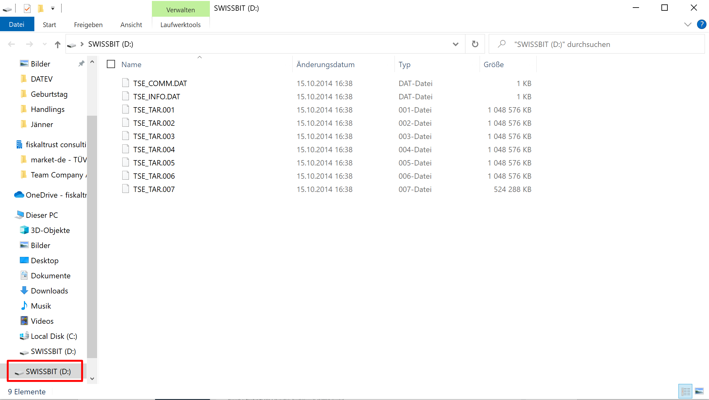

# Vorgang bei Hardware-TSE- und Kartenleser-Reklamationen

**Wenn ein Endkunde dem KassenHändler mögliche Probleme mit einer Hardware-TSE oder einem Kartenleser meldet, sollten zuerst zur genauen Abklärung folgende Tests durchgeführt werden:**

- Wird im Betriebssystem ein Laufwerksbuchstabe für die TSE angezeigt? (siehe Beispiel) 

- Haben Sie die Hardware TSE schon an einem anderen SD-Kartenleser/USB Port ausprobiert bzw. einen anderen Kartenleser getestet?
- Wird die Hardware TSE in einem anderen Computer einwandfrei erkannt?
- Haben Sie schon in den Kartenslot gepustet, um sicherzustellen, dass kein Staub das Problem verursacht? 
- Haben Sie das erweiterte Logging für die Middleware aktiviert? Prüfen Sie bitte ob in dem Log Fehlermeldungen angezeigt werden, welche einen Hinweis auf die Ursache geben können (mehr Details dazu [hier](https://docs.fiskaltrust.cloud/docs/faq/germany#exceptions-or-errors-occur-when-i-am-sending-requests-to-the-fiskaltrust-middleware-how-can-i-get-additional-debug-information-about-what-is-failing))
- Manche Kartenleser haben einen eigenen Treiber, der die Verbindung zur Hardware TSE blockieren kann. Hier hilft es oft den eigenen Treiber zu entfernen und durch den Microsoft Standard Treiber zu ersetzen.
- Die Hardware TSE kann nur an einem physischen Computer sicher und einwandfrei angesprochen werden. Das Verbinden des USB-Ports in eine virtuelle Maschine funktioniert bei den meisten virtuellen Umgebungen nicht.

**Bitte prüfen Sie all diese wesentlichen Punkte sorgfältig, um kostenpflichtige Rückweisungen zu vermeiden.**

Falls keiner dieser Punkte das Problem behebt, ist vom KassenHändler in Zusammenarbeit mit den Endkunden folgendes Formular auszufüllen und abzuschicken: 

https://link.fiskaltrust.cloud/tse-rma-request-de
